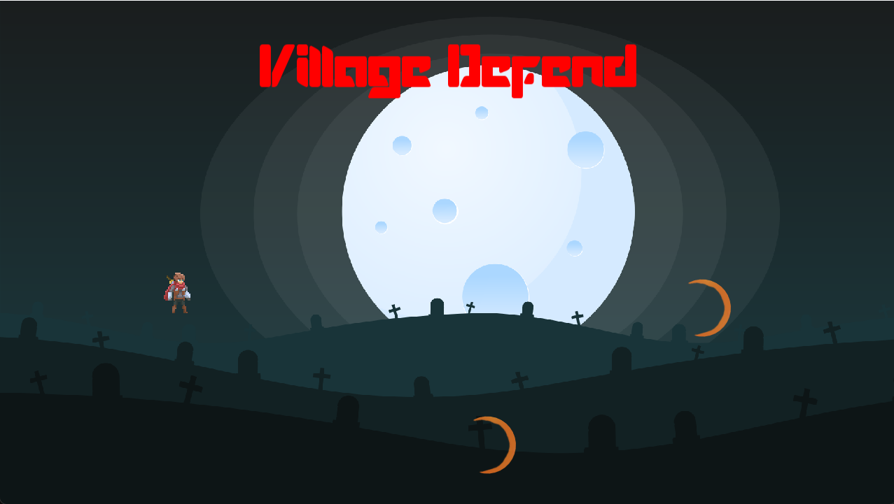
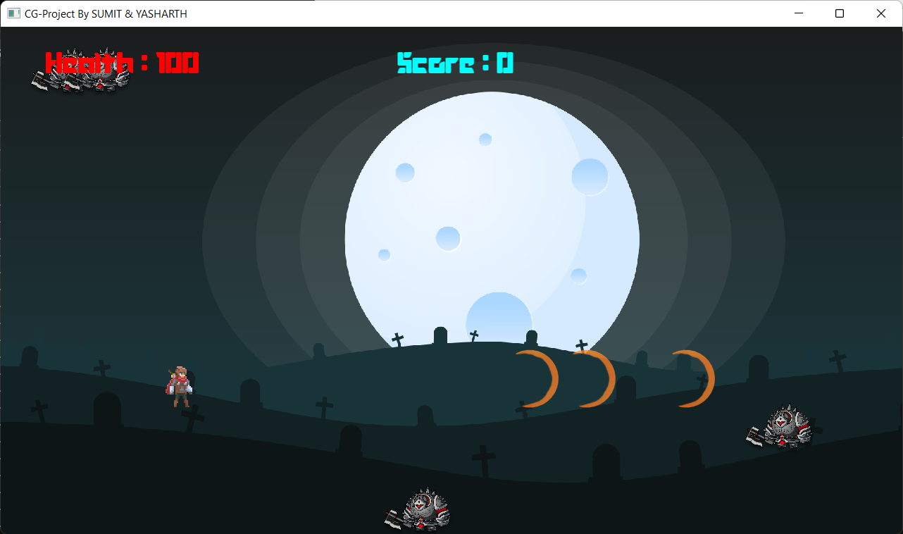

# CGProject

- This is my 6th semester project for Computer Graphics Lab.
- This Project is maintained by [ME](https://github.com/Sumit-Kumar1) and [Yasharth Yadav](https://github.com/yasharth328).

## Project Specification

- OS Used : ``Linux - POP OS 21.04``
- __g++ version__ : ``10.0``
- External Library Used : [SFML C++](https://www.sfml-dev.org/)
- __Build Command__ : _``g++ Enemy.cpp Hero.cpp AttackFlash.cpp main.cpp -o main -std=c++17 -lsfml-system -lsfml-window -lsfml-graphics``_
- Default Screen Resolution : ``1280*720``
- Standard Frame Rate count : ``60``

## GAME CONTROLS

- Player Movement :
  
       -  S or down arrow key => To move it Down.
       -  W or Up arrow Key =>  To move it Up.
       -  C => To shoot attack sprite.
       -  NOTE : `` once pressed any key UP or DOWN player will keep moving in that direction and stops at vertical thresholds``
- UI commands :
  - __ESC__ => To quit the Game
  - __R__ => To pause the game and reset.
  - __Close window__ => To quit the Game

## Contact

- if you have any suggetions and any feature or want to contribute to this poject
Mail me at: [Sumit Kumar](mailto:kumarsumitjat298@gmail.com)

## Previews

## Issue Creation Guide

- Thanks for playing the game. We hope you like this game.
- The below are some things you need to follow for creating a issue.
  1. The issue will start with a Number and in format as `CG{XX} - {your issue title}`
  2. You need to provide a proper description for the issue
  3. In case it is a Bug then please provide the steps for recreating bug in its description. Also the system and library build logs.
  